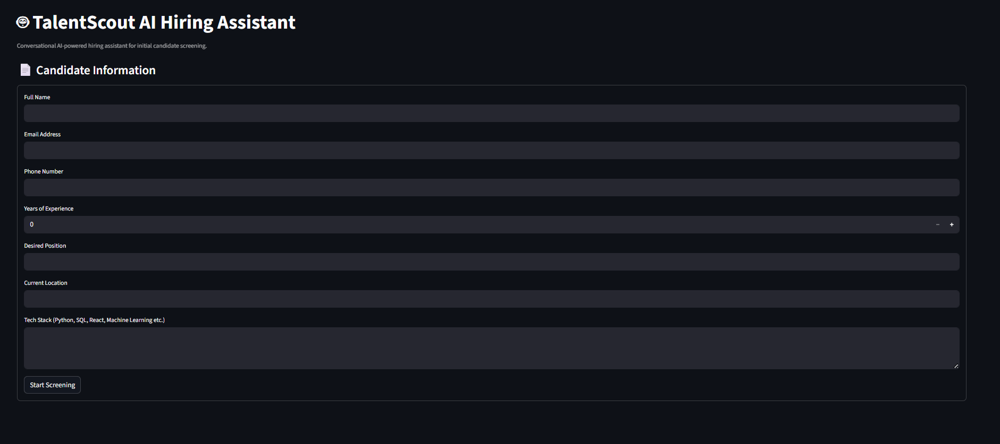
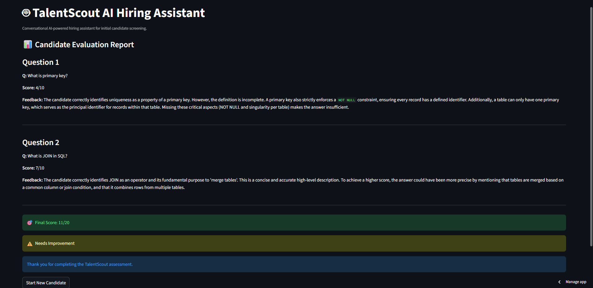

# 🤖 TalentScout AI Hiring Assistant

An AI-powered hiring assistant built using **Python**, **Streamlit**, and **Groq API (Llama 3)** for intelligent candidate screening.

The application helps recruiters automate the first round of hiring by collecting candidate details, generating technical questions dynamically based on the candidate’s tech stack, evaluating responses using AI, and producing a final assessment report.

---

# 🚀 Live Demo

🔗 https://talentscouthiringassistant-cywagkmnmtdx6fbem3uxs2.streamlit.app/

---

# 📌 Project Overview

TalentScout AI Hiring Assistant is designed for recruitment agencies and HR teams to simplify the early-stage screening process.

Instead of manually interviewing every applicant, the assistant:

- Collects candidate profile details
- Generates AI-based technical questions
- Accepts candidate answers
- Evaluates answers using AI
- Provides score-based feedback and hiring recommendation

This project demonstrates the practical implementation of **LLMs in recruitment workflows**.

---

# 🚀 Features

## ✅ Candidate Information Collection

The system collects:

- Full Name
- Email Address
- Phone Number
- Years of Experience
- Desired Position
- Current Location
- Tech Stack

---

## ✅ AI-Based Technical Question Generation

Based on the candidate's declared skills, the system dynamically generates technical interview questions using **Llama 3 via Groq API**.

Supported technologies include:

- Python
- SQL / MySQL
- React
- Machine Learning
- Custom technologies

---

## ✅ AI Answer Evaluation

Candidate responses are evaluated using AI and the system provides:

- Score out of 10
- Technical feedback
- Final total score
- Recommendation for next round

---

## ✅ Stable Fallback Evaluation System

To ensure reliability during API rate limits or network failures, the application includes a local fallback evaluation system that prevents the app from crashing and maintains uninterrupted candidate assessment.

---

## ✅ Result Dashboard

After assessment, the system displays:

- Individual question scores
- AI feedback
- Final score
- Recommendation status

---

## ✅ Data Storage

All candidate responses and scores are stored locally in:

```text
data/candidates.json
```

---

# 🛠️ Tech Stack

- **Python**
- **Streamlit**
- **Groq API (Llama 3)**
- **JSON**
- **dotenv**

---

# 📂 Folder Structure

```text
TalentScout_Hiring_Assistant/
│── app.py
│── requirements.txt
│── README.md
│── .env
│── .gitignore
│── data/
│   └── candidates.json
│── screenshots/
│   ├── form.png
│   └── result.png
│── utils/
│   ├── __init__.py
│   ├── validators.py
│   ├── storage.py
│   └── llm.py
```

---

# 📸 Project Screenshots

## 📝 Candidate Information Form

This screen collects candidate details such as name, email, phone number, experience, desired role, location, and tech stack.



---

## 📊 AI Evaluation Dashboard

After submission, the assistant evaluates candidate answers using AI, provides scores, feedback, final score, and hiring recommendation.



---

# ⚙️ Installation & Setup

## 1️⃣ Clone Repository

```bash
git clone https://github.com/AkarshKumar1/TalentScout_Hiring_Assistant.git

cd TalentScout_Hiring_Assistant
```

---

## 2️⃣ Install Dependencies

```bash
pip install -r requirements.txt
```

---

## 3️⃣ Add API Key

Create a `.env` file in the root folder:

```env
GROQ_API_KEY=my_groq_api_key
```

---

## 4️⃣ Run Application

```bash
streamlit run app.py
```

---

# 🌐 Deployment (Streamlit Cloud)

This project can be deployed on **Streamlit Community Cloud**.

## Steps:

1. Push project to GitHub
2. Open Streamlit Community Cloud
3. Connect GitHub repository
4. Select `app.py`
5. Add secret:

```toml
GROQ_API_KEY="my_groq_api_key"
```

---

# 🧠 AI & Prompt Engineering

## Dynamic Question Generation

The assistant generates interview questions dynamically according to the candidate’s declared tech stack.

## AI Answer Evaluation

The AI model evaluates candidate responses and returns:

- Technical score
- Feedback
- Evaluation result

---

# 🔐 Data Privacy

- Candidate data is stored locally for demo purposes.
- No personal data is shared externally except AI evaluation requests.
- API keys are securely stored using `.env` or Streamlit Secrets.

---

# ⚠️ Challenges Solved

During development, the following challenges were addressed:

- Streamlit rerun issues using `session_state`
- Multi-step workflow handling
- Groq API integration
- AI response parsing
- API rate limit handling
- Stable fallback evaluation system
- Blank answer handling
- Candidate data storage

---

# 📈 Future Improvements

- Resume Upload Feature
- Recruiter Admin Dashboard
- Candidate Ranking System
- PDF Report Export
- Email Notifications
- Multi-language Support
- Voice-Based Interview Assistant

---

# 👨‍💻 Author

## Akarsh Kumar

B.Tech CSE (AI/ML) Student

Passionate about:
- Artificial Intelligence
- Machine Learning
- Real-World Product Development

---

# ⭐ Final Note

This project was developed as part of an AI/ML Internship Assignment to demonstrate the practical implementation of AI-powered hiring automation using Large Language Models.
